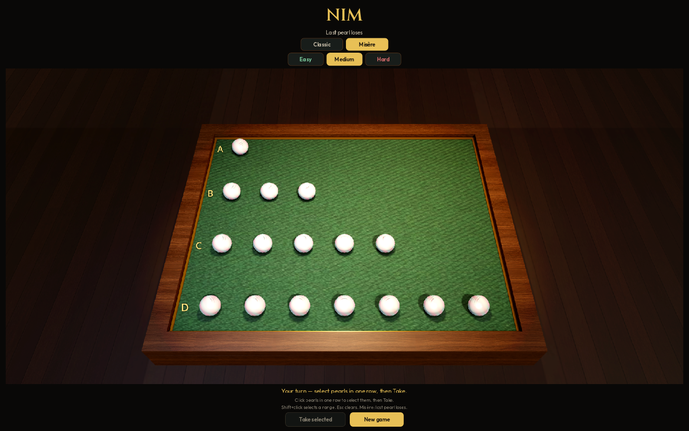

# Nim

3D Nim in Godot 4. Four heaps of pearls in the Marienbad layout (1, 3, 5, 7). Click pearls in a single row to select them, then **Take**. Shift+click selects a range; Esc or a click on the table clears the selection.

## Rules

Heaps follow Bouton (1901–02): any number of objects, taken from a **single** pile, at least one per turn; piles start unequal. The opening 1-3-5-7 is the four-row tableau from *Last Year at Marienbad* (misère). Bouton's own write-up used three piles of arbitrary unequal size.

**Classic** — the player who takes the last pearl wins (Bouton's rule).

**Misère** — the player forced to take the last pearl loses (Marienbad).

**New game** from a match returns to setup so Classic/Misere and difficulty can be changed. Press **New game** again to start; who goes first is random. Those options lock while a match is in progress.

| Level | Behaviour |
|---|---|
| Easy | 25% optimal play, 75% random |
| Medium | 60% optimal play, 40% random |
| Hard | Always plays optimally |

Hard Classic is perfect XOR play. Hard Misère uses the standard misère correction when only one heap larger than one remains.

## Building

Requires [Godot 4.4+](https://godotengine.org/) with export templates installed.

Export presets are included for macOS (universal), Windows (x86_64), Linux (x86_64), and Web (WASM).

Fonts: [Fraunces](https://fonts.google.com/specimen/Fraunces) and [Figtree](https://fonts.google.com/specimen/Figtree), SIL Open Font License.
